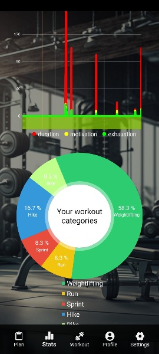

# WORKOUT TRACKER
### Android app for tracking your workout sessions over time and visualization of your progress &amp; consistency.
#### Developed in Kotlin & XML, using the Android Studio IDE.

## FEATURES
- [x] create a new account (name, email & password)
- [x] log into your newly created account
- [x] log activities (set discipline, time, duration, assess your motivation at the start & your exhaustion at the end)
- [x] visualize the stats of your workout sessions with graphs & a pie chart
- [x] view your user profile (quickly edit & update your bio, see your user info, logout)
- [x] display, filter & sort all your past activities (with all their stats)
- [ ] formulate, save & edit your own workout plan (select specific exercises from different muscle groups for each day of the week)
- [ ] settings page (change color theme, language, layout of the navigation bar...)
 

| LANDING PAGE                                                        | ADD WORKOUT PAGE                                            | PROFILE PAGE                                                  |
| :---:                                                               | :---:                                                       | :---:                                                         |
|  |  |    |
| STATS PAGE                                                          | PIE CHART                                                   | PAST WORKOUTS                                                 |
|              |        |  |

 

## WORK IN PROGRESS...

| CREATE WORKOUT PLAN                                                 |
| :---:                                                               |
|  |
